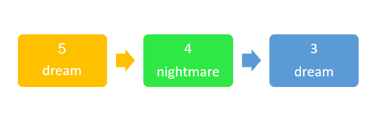

[_metadata_:id]:- "inception"
[_metadata_:title]:- "اینسپشن"
[_metadata_:level]:- "medium"
[_metadata_:author]:- "فاطمه عبدالهی"
[_metadata_:series]:- "structures-and-templates"

+ محدودیت زمان: ۱ ثانیه
+ محدودیت حافظه: ۲۵۶ مگابایت

----------

دیکاپریو برای دزدیدن یک پسورد از ذهن رابرت فیشر، به چند لایه خواب مصنوعی رفته است، اما بعد از سال‌ها هنوز بیدار نشده است.

بردیا تمام این سال‌ها صرف تحقیق کرده است تا بالأخره وضعیت زنده بودن دیکاپریو را مشخص کند. او متوجه شده است هر خواب سه ویژگی دارد:

1. امنیت خواب: یک عدد است از ۰ (خطرناک‌ترین) تا ۵ (امن‌ترین).
2. حالت خواب: یک رشته است که می‌تواند `dream` یا `nightmare` باشد.
3. اشاره‌گر به خواب لایه بعد: اگر درون خواب یک لایه خواب دیگر باشد به آن اشاره می‌کند و در غیر این صورت تهی (`nullptr`) است.

استراکچر خواب را بدین صورت در نظر بگیرید:
```cpp
struct Sleep {
    int security;
    string State;
    Sleep* nextLayer;
};
```

خوابی بد است که دو ویژگی داشته باشد:
1. امنیت خواب کمتر یا مساوی ۲ باشد.
2. حالت خواب `nightmare` باشد.

بردیا می‌داند که اگر بیشتر یا مساوی نصف لایه‌های خواب شخصی بد باشند او قطعا می‌میرد. حال در خروجی بگویید دیکاپریو هنوز زنده است یا خیر.

# محدودیت

مسئله حتماً با استفاده از استراکچر مذکور (داده‌ساختار لیست پیوندی) باید حل شود. برای تشخیص زنده بودن تابعی بزنید که از سطحی‌ترین خواب شروع کند و با استفاده از اشاره‌گر به خواب‌های عمیق‌تر برود. در صورت نبود چنین پیمایشی جواب شما پذیرفته نیست.

# ورودی
در خط اول عدد طبیعی $t$ می‌آید که نشان‌دهنده تعداد لایه‌های خواب است. در $t$ خط بعدی از لایه عمیق به سطحی خصوصیات خواب به‌ترتیب می‌آیند که با یک فاصله از هم جدا شده‌اند.

# خروجی
خروجی عبارت `he is dead` یا `he is still alive` است که به‌ترتیب نشان‌دهنده مرده یا زنده بودن دیکاپریو است. 

# مثال
## ورودی نمونه ۱
```
3
3 dream
4 nightmare 
5 dream 
```



## خروجی نمونه ۱

```
he is still alive
```

