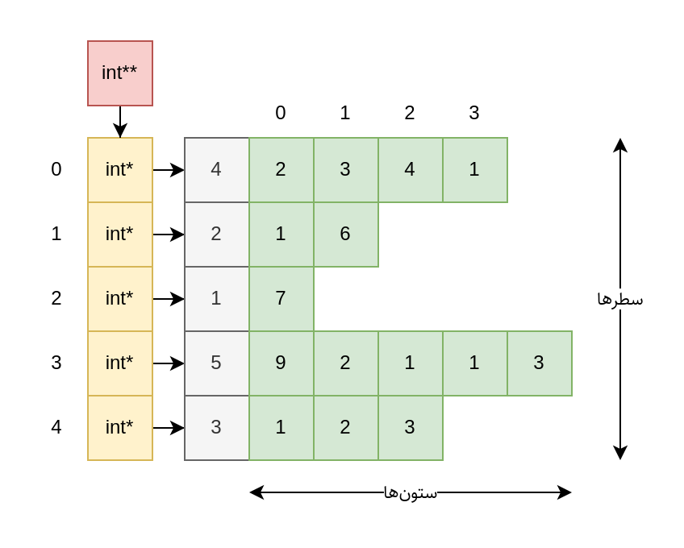

[_metadata_:id]:- "jagged-2d-array"
[_metadata_:title]:- "آرایه دوبعدی ناتراز"
[_metadata_:level]:- "hard"
[_metadata_:author]:- "کاظم فرقانی"
[_metadata_:series]:- "pointers-and-dynamic-arrays"

+ محدودیت زمان: ۱ ثانیه
+ محدودیت حافظه: ۲۵۶ مگابایت

----------

در این سؤال از شما می‌خواهیم با استفاده از مفاهیم اشاره‌گرها و آرایه‌های پویا یک آرایه دوبعدی از اعداد صحیح طراحی کنید که هر سطر آن بتواند تعداد متفاوتی از اعداد را نگهداری کند. از خانه اول هر سطر برای نگهداری تعداد اعداد موجود در آن سطر استفاده کنید.

جهت درک بهتر داده‌ساختار مذکور به نمونه زیر توجه نمایید.



سپس با استفاده از چهار عملیات زیر نشانگری را که ابتدا در خانه $(0, 0)$ قرار دارد حرکت می‌دهیم.

| عملیات | عملکرد |
| --- | --- |
| U | حرکت به بالا (سطر قبلی) |
| D | حرکت به پایین (سطر بعدی) |
| R | حرکت به راست (ستون بعدی) |
| L | حرکت به چپ (ستون قبلی) |

برای حرکت میان ستون‌ها

+ اگر نشانگر به انتهای سطر رسیده بود حرکت به راست آن را به ابتدای سطر بعدی می‌برد. اگر سطر بعدی وجود نداشت حرکت بی‌اثر است.
+ اگر نشانگر در ابتدای سطر بود حرکت به چپ آن را به انتهای سطر قبلی می‌برد. اگر سطر قبلی وجود نداشت حرکت بی‌اثر است.

برای حرکت میان سطرها

+ اگر نشانگر در خانه $i$ام سطر جاری وجود داشت حرکت به بالا یا حرکت به پایین آن را به خانه $i$ام سطر جدید می‌برد. اگر سطر جدید خانه $i$ام نداشت نشانگر به آخرین خانه سطر جدید می‌رود.
+ حرکت به بالا در سطر اول و حرکت به پایین در سطر آخر بی‌اثر است.

در نهایت از شما می‌خواهیم مختصات و مقدار خانه‌ای را که در انتها نشانگر در آن قرار دارد خروجی دهید.

# ورودی

در سطر اول عدد طبیعی $n$ می‌آید که بیانگر تعداد سطرهای آرایه است. سپس در هر کدام از $n$ خط بعدی ابتدا عدد طبیعی $m_i$ می‌آید که نشان‌دهنده تعداد اعداد آن سطر است و سپس $m_i$ عدد صحیح در همان خط داده می‌شود که با فاصله از هم جدا می‌شوند و تضمین می‌شود قدرمطلق هیچ یک از آنها از $10^9$ بیشتر نیست.

$$ 1 \leq n \leq 50 $$

$$ 1 \leq m_i \leq 10^2 $$

در آخرین خط رشته‌ای از عملیات‌ها به طول حداکثر $5 \times 10^2$ می‌آید که می‌بایست به‌ترتیب روی نشانگری که ابتدا در خانه $(0, 0)$ قرار دارد اعمال شوند.

# خروجی

در تنها خط خروجی مختصات و مقدار خانه‌ای که در انتها نشانگر در آن قرار دارد را با یک فاصله از هم خروجی دهید.

# محدودیت

ساخت انواع داده `int**` و `int*` با استفاده از عملگر `new` الزامی است.

کدهای ارسالی شما بررسی می‌شوند و در صورتی که طبق خواسته سؤال پیاده‌سازی نشده باشند نمره‌ای به آنها تعلق نمی‌گیرد.

# مثال

## ورودی نمونه ۱

```
3
1 1
3 2 9 6
2 5 3
DRR
```


## خروجی نمونه ۱

```
1 2 6
```


## ورودی نمونه ۲

```
5
3 2 5 8
1 3
5 2 9 6 7 3
2 1 4
1 0
LURRRRDRULL
```


## خروجی نمونه ۲

```
1 0 3
```

