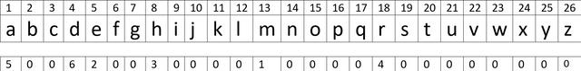

[_metadata_:id]:- "under-the-palms"
[_metadata_:title]:- "زیر نخلا، تک و تنها"
[_metadata_:level]:- "medium"
[_metadata_:author]:- "محمدمهدی پورحیدری"
[_metadata_:series]:- "arrays-and-recursion"
+ محدودیت زمان: ۱ ثانیه
+ محدودیت حافظه: ۲۵۶ مگابایت

----------

مهراد، دوست ارشیا با قایق شخصی پدرش به جزیره تنب متوسط سفر کرده است. او تک و تنها در زیر نخل‌ها به سنگ‌ها تکیه داده و حوصله‌اش سر رفته است. از آنجایی که این جزیره خیلی نزدیک به ساحل خلیج فارس است، ارشیا می‌تواند با استفاده از دوربین شکاری بردیا، که آن را بدون اجازه از وسایل او کش رفته است، مهراد را ببیند.
مهراد و ارشیا از قبل برنامه‌ای برای برقراری ارتباط از راه دور ریخته‌اند که شخص دیگری نتواند آن را رمزگشایی کند و متوجه صحبت آنها شود.

روش آنها به این صورت است که هر حرف الفبای انگلیسی را یک خانه از عدد در نظر گرفته‌اند که در خانه $i$ام عدد $m_i$ وجود دارد که نشانگر اندیس آن حرف در پیام اصلی است. تضمین می‌شود از هر حرف الفبا حداکثر یک مورد وجود دارد و تعداد حروف یک کلمه از ۹ تجاوز نمی‌کند.

به مثال زیر توجه کنید. ردیف اول نشان‌دهنده $i$ها و ردیف سوم نشان‌دهنده $m_i$ها می‌باشد.



اگر این حروف را به ترتیب $m_i$ها کنار هم بگذاریم کلمه `mehrad` به‌دست می‌آید!

مهراد و ارشیا قصد دارند این روش خود را با نوشتن روی شن پیاده‌سازی کنند. حال شما با تعریف تابعی بازگشتی به ارشیا در رمزگشایی کمک کنید.

# ورودی

خط اول ورودی، عدد طبیعی $n$ است که تعداد رمزهایی را نشان می‌دهد که نیاز به رمزگشایی دارند.

در هر یک از $n$ خط بعدی، رشته‌ای از اعداد به طول ۲۶ که نشان‌دهنده $m_i$ها می‌باشد داده شده است.

$$1 \le n \le 10$$
# خروجی
خروجی باید پیام‌های استخراج شده از رمزها به‌ترتیب باشد که بین هر کدام از آنها یک فاصله قرار داده شده است.

برای فهم بهتر خواسته مسئله به مثال‌ها توجه کنید.

# مثال
## ورودی نمونه ۱
```
2
00002001000300040000000000
00002000000010000000000000
```


## خروجی نمونه ۱
```
help me
```

در رمز اول، اندیس‌های ۵ و ۸ و ۱۲ و ۱۷ دارای عددی غیرصفر هستند که با توجه به ترتیب آنها، اول اندیس ۸ که نظیر حرف `h`، سپس اندیس ۵ که نظیر حرف `e`، سپس اندیس ۱۲ که نظیر حرف `l` و در آخر اندیس ۱۷ که نظیر حرف `p` می‌باشد آمده است.

همین کار را برای رمز دوم نیز انجام می‌دهیم.
