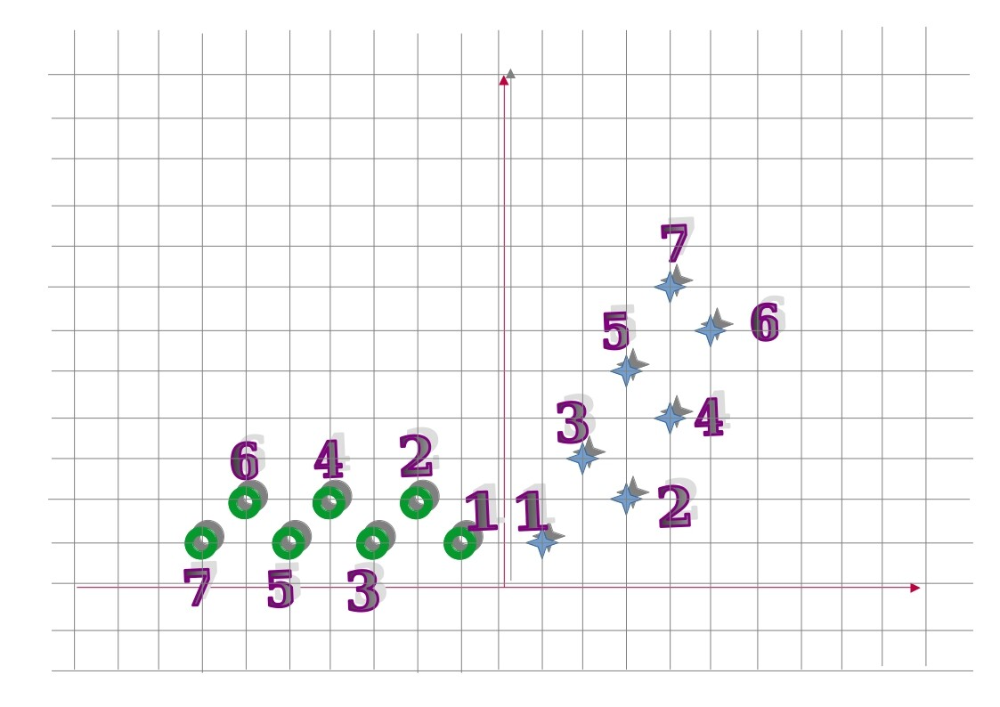

[_metadata_:id]:- "violent-duel"
[_metadata_:title]:- "دوئل خشمگین"
[_metadata_:level]:- "easy"
[_metadata_:author]:- "ایلیا کاهنی"
[_metadata_:series]:- "more-flow-of-control"

+ محدودیت زمان: ۱ ثانیه
+ محدودیت حافظه: ۲۵۶ مگابایت

----------



اکبر و اصغر می‌خواهند با یکدیگر دوئل کنند، اما دوئل آنها کمی با دوئل معمولی متفاوت است.
در این دوئل، اکبر و اصغر هر کدام با الگوی حرکتی منحصربه‌فردی (مطابق تصویر) از یکدیگر دور می‌شوند.
در این سؤال از شما می‌خواهیم در یک مرحله خاص فاصله آنها را از یکدیگر به صورت یک عدد اعشاری (با دقت دو رقم اعشار) چاپ کنید.

# ورودی

تنها ورودی شما در این سوال عدد صحیح $n$ است که بیانگر مرحله‌ای است که اکبر و اصغر در آن قرار دارند.
$$1 \le n \le 10000$$
# خروجی

خروجی برنامه شما باید یک عدد با دو رقم اعشار باشد که بیانگر فاصله اکبر و اصغر از یکدیگر است.

# مثال
## ورودی نمونه ۱
```
2
```


## خروجی نمونه ۱
```
5.00
```

در مرحله دوم اکبر در نقطه $(3,2)$ و اصغر در نقطه $(-2,2)$ قرار دارد که فاصله آنها از یکدیگر برابر با ۵ واحد است. 

## ورودی نمونه ۲
```
7
```


## خروجی نمونه ۲
```
12.53
```


در مرحله هفتم اکبر در نقطه $(4,7)$ و اصغر در نقطه $(-7,1)$ قرار دارد که فاصله آنها از یکدیگر برابر با ۱۲.۵۲۹۹ واحد است که گرد شده آن تا دو رقم اعشار ۱۲.۵۳ می‌شود.
